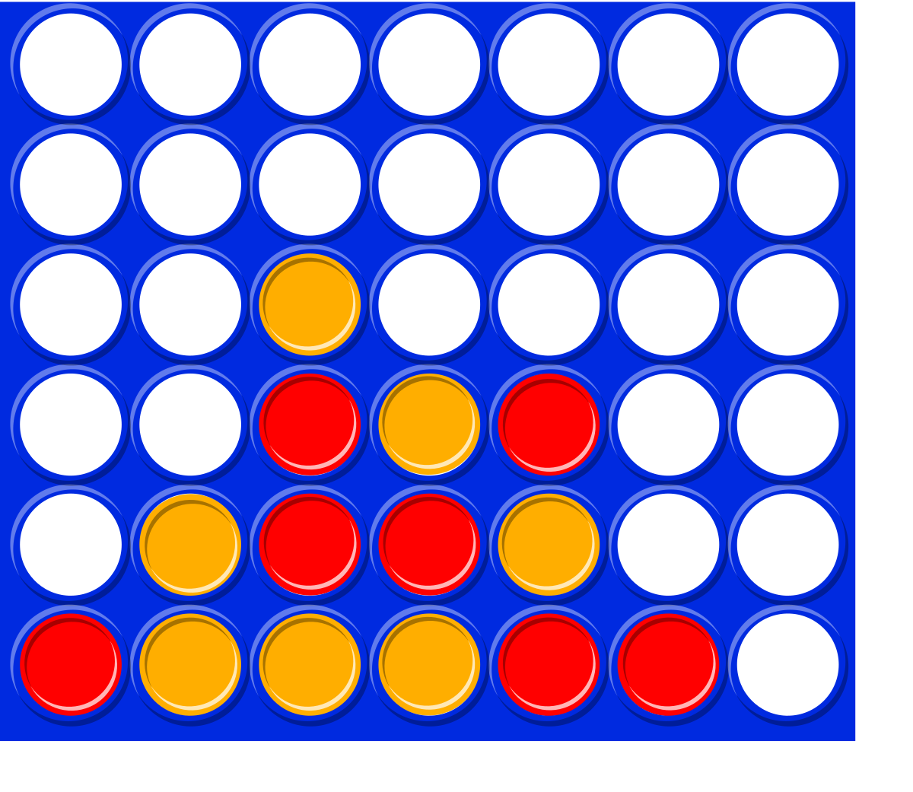

# Scarface
Projet python portant sur le jeu Puissance4 réalisé en binôme.

## Binôme
- Dohemeto Bonaventure
- Balakimbiyou Sakiye

## Table des matières
- [Exercice 1: Comprendre la Puissance 4](#exercice-1-comprendre-la-puissance-4)
  - [Partie 1: Analyse des règles du jeu](#partie-1-analyse-des-règles-du-jeu)
    - [Tâche 1.1 : Analyse des règles du jeu](#tâche-11--analyse-des-règles-du-jeu)
    - [Tâche 1.2 : Analyse des conditions de victoire](#tâche-12--analyse-des-conditions-de-victoire)
  - [Partie 2](#partie-2)
    - [Tâche 2.1](#tâche-21)
    - [Tâche 2.2](#tâche-22)
    - [Tâche 2.3](#tâche-23)
    - [Tâche 2.4](#tâche-24)
  - [Partie 3](#partie-3)
    - [Tâche 3.1:](#tâche-31)
    - [Tâche 3.2 Conception d'algorithme](#tâche-32-conception-dalgorithme)
    - [Tâche 3.3](#tâche-33)
- [Exercice 2: Implémentation d'un agent aléatoire](#exercice-2-implémentation-dun-agent-aléatoire)
  - [Partie 1: Implémentation](#partie-1-implémentation)
    - [Tâche 2.1: Agent random_agent.py](#tâche-21-agent-random_agentpy)
    - [Tâche 2.2: Suite implémentation](#tâche-22-suite-implémentation)
    - [Tâche 2.3 Implémentation alternative](#tâche-23-implémentation-alternative)
  - [Partie 2: Tester l'agent](#partie-2-tester-lagent)
    - [Tâche 2.4: Script de test](#tâche-24-script-de-test)
    - [Tâche 2.5: Exécution le test](#tâche-25-exécution-le-test)
    - [Tâche 2.6: Tests pour plusieurs parties](#tâche-26-tests-pour-plusieurs-parties)
  - [Partie 3: Analyse](#partie-3-analyse)
    - [Tâche 2.7: Analyse statistique](#tâche-27-analyse-statistique)
    - [Tâche 2.8: Liste de vérification du code](#tâche-28-liste-de-vérification-du-code)
  - [Partie 4: Extension](#partie-4-extension)
    - [Tâche 2.9: Aléatoire pondéré](#tâche-29-aléatoire-pondéré)
    - [Tâche 2.10: Ajouter des logs](#tâche-210-ajouter-des-logs)
- [Exercice 3: Implémenter un agent basé sur des règles](#exercice-3-implémenter-un-agent-basé-sur-des-règles)
  - [Partie 1: Planification](#partie-1-planification)
    - [Tâche 3.1:](#tâche-31-1)
    - [Tâche 3.2:](#tâche-32)
  - [Partie 2: Implémentation de base](#partie-2-implémentation-de-base)
  - [Partie 3: Tests](#partie-3-tests)
    - [Tâche 3.5: Tests unitaires](#tâche-35-tests-unitaires)
    - [Tâche 3.6: Test d'intégration](#tâche-36-test-dintégration)
  - [Partie 4: Amélioration stratégique](#partie-4-amélioration-stratégique)
  - [Partie 5: Analyse](#partie-5-analyse)
- [Exercice 4](#exercice-4)
  - [Partie 1 : Conception de stratégie de test](#partie-1--conception-de-stratégie-de-test)
  - [Partie 2 : Implémentation de la stratégie de tests](#partie-2--implémentation-de-la-stratégie-de-tests)
- [Exercice 5:](#exercice-5)

---

## Partie 1: Analyse des règles du jeu

### Tâche 1.1 : Analyse des règles du jeu
1. Les dimensions d'un tableau de Puissance 4: 6 rangées sur la hauteur et 7 colonnes. Soit 42 emplacements.

2. Un joueur gagne la partie s'il arrive à aligner un 4 jetons consécutifs (au moins) suivant une ligne horizontale, verticale ou suivant les diagonales.

3. Si le plateau est complètement rempli sans gagnant, la partie se termine avec un MATCH NUL.

4. Non, un joueur ne peut pas placer un pion dans une colonne déjà pleine. Il doit choisir une colonne qui contient au moins une case vide.

5. Les résultats possibles. Soit le Joueur 1 gagne, soit le joueur 2 gagne, soit il y un Match NUL.

### Tâche 1.2 : Analyse des conditions de victoire
1. Dessin des 4 motifs:

        ------------------------------------
        
        |  O |  O |  O |  O |    |    |  O |
        
        ------------------------------------
        
        |    |    |    |    |    |    |  O |
        
        ------------------------------------
        
        |    |    |    |  O |    |    |  O |
        
        ------------------------------------
        
        |    |    |  O |    |  O |    |  O |
        
        ------------------------------------
        
        |    |  O |    |    |    |  O |    |
        
        ------------------------------------
        
        |  O |    |    |    |    |    |  O |
        
        ------------------------------------

2. 4 directions au plus doivent être vérifiées pour une victoire. En particulier si la position donnée est au coin (du bas) , il n'y a plus que 3 directions à vérifier.

3. L'algorithme pour vérifier l'alignement de 4 points est :
    Pseudo Code:
    # direction horizontale (vers la droite)
        Entrées: Position initiale (row,col)
            On initialise compteur = 1;
            On parcourt la ligne (vers la droite):
                Tant que la case(courante) existe et contient un élément du joueur, 
                    compteur = compteur + 1
        Sorties: victoire, si compteur >=4  
        
    # direction horizontale (vers la gauche)
        Entrées: Position initiale (row,col)
            On initialise compteur = 1;
            On parcourt la ligne (vers la gauche):
                Tant que la case(courante) existe et contient un élément du joueur, 
                    compteur = compteur + 1
        Sorties: victoire, si compteur >=4  
    # direction vertical (vers le haut)
        Entrées: Position initiale (row,col)
            On initialise compteur = 1;
            On parcourt la ligne (vers le haut ):
                Tant que la case(courante) existe et contient un élément du joueur, 
                    compteur = compteur + 1
        Sorties: victoire, si compteur >=4  
    # direction verticale (vers le bas)
        Entrées: Position initiale (row,col)
            On initialise compteur = 1;
            On parcourt la ligne (vers le bas):
                Tant que la case(courante) existe et contient un élément du joueur, 
                    compteur = compteur + 1
        Sorties: victoire, si compteur >=4  
        
    # direction oblique (montante)
        Entrées: Position initiale (row,col)
            On initialise compteur = 1;
            On parcourt la ligne (vers le haut):
                Tant que la case(courante) existe et contient un élément du joueur, 
                    compteur = compteur + 1
        Sorties: victoire, si compteur >=4  
    # direction oblique (descendante)
        Entrées: Position initiale (row,col)
            On initialise compteur = 1;
            On parcourt la ligne (vers le bas):
                Tant que la case(courante) existe et contient un élément du joueur, 
                    compteur = compteur + 1
        Sorties: victoire, si compteur >=4  

## Partie 2

### Tâche 2.1
1. Noms des deux agents: player_0 et player_1

2. La variable "action" représente la colonne où le joueur veut déposer son jeton.
   La variable "action" est de type: int.
   
3. env.agent_iter() : est un itérateur qui renvoi à chaque itération l'agent actif.
   env.step(action) : permet de jouer "action" sur l'agent actif, met à jour le jeu et passe au tour suivant.
   
4. env.last() renvoi un tuple avec les informations du tour actuel: observation, reward(récompense de l'agent), termination(booleen indiquant si la partie est terminée), truncation( booleen indiquant si la partie s'est arrêté pour une raison inconnue autre que celle définie), info(dictionnaires avec des infos supplémentaires).

5. obs['observation'] : une matrice 6x7 représentant le plateau (0 = vide, 1 = pion du joueur, 2 = pion adversaire)

obs['action_mask'] : un tableau de 7 booléens indiquant les colonnes où un jeton peut être joué (True = jouable, False = interdit)

6. "action mask" permet de savoir quelles actions sont légales à ce tour. C'est un tableau.

### Tâche 2.2
1. Forme du tableau d'observation: 6 * 7 

2. Représentation des dimensions: (6: les lignes du plateau), (7: les colonnes du plateau)

3. Valeurs possibles dans le tableau d'observation: O pour case vide; 1 pion  du joueur actif; 2 pour pion de l'adversaire.

### Tâche 2.3
Fait

### Tâche 2.4
Fait

## Partie 3

### Tâche 3.1: 
1. Analyse des entrées: L'agent reçoit les informations suivantes:
observation, reward, termination, truncation, info.

    -observation["observation"]:un tableau numpy de taille (6,7,2)
    -observation["action_mask"]: un tableau où 1 représente les colonnes jouables et 0 les colonnes non jouables(soit pleines).
    -reward : récompense du dernier coup
    
2. Détection des coups valides: 
Pour déterminer quelles colonnes sont jouables, on va utiliser action_mask. 
Si action_mask[i] == 1 avec 0 <= i <= 6, alors la colonne concerné est jouable.

3. Pour choisir un coup plusieurs moyens sont possibles. 
    -On choisit un coup de façon aléatoire parmis les coups légaux
    -On recherche un coup gagnant immédiat
    -On vérifie si l'adversaire à un coup gagnant et on le bloque si oui
    -Si aucun des deux précédents, on peut jouer un coup stratégique.

4. Comme sortie, l'agent doit retourner un "int" qui représente la colonne où il veut jouer.

### Tâche 3.2 Conception d'algorithme
Algoritgme par ordre de complexité:
1. 
*Niveau 0 : Agent totalement aléatoire
Ici l'agent choisit simplement une colonne au hasard, sans vérifier si la colonne est pleine. C’est le comportement le plus basique possible.

* Niveau 1 : Agent aléatoire mais valide
Ici, l’agent est un peu plus intelligent : il choisit toujours une colonne aléatoire, mais uniquement parmi les colonnes encore jouables. Il évite donc les coups invalides.

* Niveau 2 : Agent opportuniste (attaque immédiate)
Cet agent vérifie d’abord s’il existe un coup qui lui permet de gagner directement (faire un alignement de 4). Si oui, il joue ce coup. Sinon, il retombe sur un choix aléatoire parmi les coups valides.

* Niveau 3 : Agent défensif
En plus de chercher à gagner immédiatement, cet agent vérifie si l’adversaire pourrait gagner au prochain tour. Si c’est le cas, il bloque cette colonne en priorité. On a donc deux priorités :

gagner soi-même,

empêcher l’adversaire de gagner.

* Niveau 4 : Agent positionnel / stratégique
Cet agent utilise des heuristiques plus avancées, comme :

privilégier les colonnes centrales,

construire des "menaces" (alignements de 2 ou 3),

éviter de jouer des coups qui donnent une victoire facile à l’adversaire.
Il ne regarde plus seulement les coups immédiats, mais réfléchit au placement global.

* Niveau 5+ : Algorithmes avancés
À ce niveau, on utilise de vrais algorithmes d’intelligence artificielle.
Ces agents évaluent plusieurs coups à l’avance et se rapprochent du niveau expert.

### Tâche 3.3
Squelette de la classe Agent:
    class Agent:
    def __init__(self, name="GenericAgent", level=0):
        """
        Initialise l'agent.
        
        Parameters:
        - name : str, nom de l'agent
        - level : int, niveau de stratégie (0 = aléatoire, 1 = valide, ...)
        """
        self.name = name
        self.level = level
        self.history = []  # liste des coups joués par cet agent
        self.last_observation = None  # dernière observation reçue
        self.last_action = None       # dernier coup joué

    def choose_action(self, observation, action_mask=None):
        """
        Méthode principale qui retourne l'action à jouer.

        Parameters:
        - observation : np.array, l'état du plateau
        - action_mask : np.array

        Returns:
        - int : numéro de la colonne choisie
        """
        raise NotImplementedError("Cette méthode sera surchargée selon la stratégie.")

    def update_history(self, observation, action):
        """
        Met à jour l'historique des coups et observations.
        """
        self.last_observation = observation
        self.last_action = action
        self.history.append((observation.copy(), action))

    def reset(self):
        """
        Réinitialise l'agent entre deux parties.
        """
        self.history = []
        self.last_observation = None
        self.last_action = None

    def __str__(self):
        """
        Affiche des informations sur l'agent.
        """
        return f"Agent(name={self.name}, level={self.level})"
        
#TEXTE DE DECOMPOSITION DU PROBLEME-PLAN DE PROGRESSION D'AGENT

Analyse des entrées
    L’agent reçoit à chaque tour une observation de l’environnement, qui contient :

        -La position des jetons du joueur courant (observation[:,:,0])

        -La position des jetons de l’adversaire (observation[:,:,1])

        -Le masque des actions valides (action_mask), indiquant les colonnes jouables

        -D’autres informations  comme reward, termination, truncation.

Détection des coups valides
    L’agent doit identifier quelles colonnes sont jouables en utilisant l’action_mask fourni par l’environnement.
    Une colonne est jouable si son masque vaut 1. Les colonnes pleines doivent être exclues.

Sélection du coup
    L’agent décide quelle colonne jouer en fonction de sa stratégie.

        -Niveau bas : aléatoire parmi les colonnes valides

        -Niveau moyen : chercher un coup gagnant immédiat ou bloquer l’adversaire

        -Niveau avancé : stratégie globale, anticipation des coups, heuristiques etc...

Sortie
    L’agent retourne l’action choisie sous forme d’un entier correspondant à la colonne (0 à 6).

2. Plan de progression d'agent

Pour passer d’un agent simple à un agent performant:

Niveau 0 – Agent aléatoire
        Choisit une colonne au hasard sans vérifier si elle est jouable.

Niveau 1 – Agent aléatoire valide
        Choisit une colonne au hasard mais uniquement parmi les colonnes jouables. Évite les erreurs.

Niveau 2 – Agent opportuniste
        Vérifie si un coup permet de gagner directement.
        Si oui: joue ce coup. Sinon: joue aléatoirement parmi les coups valides.

Niveau 3 – Agent défensif
        Cherche à bloquer l’adversaire en plus de chercher son propre coup gagnant.
        Priorité : gagner -> bloquer -> coup aléatoire valide.

Niveau 4 – Agent stratégique (heuristiques)
        Utilise des stratégies:

            -jouer au centre,

            -créer plusieurs menaces,

            -éviter de donner une victoire facile à l’adversaire,

            -maximiser les alignements de 2 ou 3 jetons prometteurs.

Niveau 5+ – Agent avancé: Implémente des algorithmes sophistiqués.

## Exercice 1: Implémentation d'un agent aléatoire

### Partie 1: Implémentation

#### Tâche 2.1: Agent random_agent.py
(Voir fichier random_agent.py)

#### Tâche 2.2: Suite implémentation
(Voir fichier random_agent.py)

#### Tâche 2.3 Implémentation alternative
(Voir fichier random_agent.py)

### Partie 2: Tester l'agent

#### Tâche 2.4: Script de test
(Voir fichier test_random_agent.py)

#### Tâche 2.5: Exécution le test
1. Le jeu s'exécute sans erreus.
2. Oui l'agent fait des coups valides.
3. Le jeu se termine correctement.
4. Le nombre de coups est moyennement 14.

#### Tâche 2.6: Tests pour plusieurs parties
(Voir fichier test_random_agent.py) 

### Partie 3: Analyse

#### Tâche 2.7: Analyse statistique
(Voir random_agent_analysis.md)

#### Tâche 2.8: Liste de vérification du code
 - Oui l'agent gère correctement le masque d'action. 

 - Oui le code à une documentation appropriée.

 - Oui les noms de variables sont clairs et adaptatifs.
 
 - Oui l'agent fonctionne pour le joueur 1 et pour le joueur 2.
 
 - (...)

### Partie 4: Extension

#### Tâche 2.9: Aléatoire pondéré
(Voir fichier WeightedRandomAgent.py et TestWeightedRandomAgent.py)

#### Tâche 2.10: Ajouter des logs
(Voir fichier LogWeightedRandomAgent.py et TestLogWeightedRandomAgent.py)

## Exercice 3: Implémenter un agent basé sur des règles

### Partie 1: Planification

#### Tâche 3.1:
(Fait)

#### Tâche 3.2:

choose_action()
    ├── get_valid_actions() - Récupère les colonnes jouables
    ├── check_winning_move() - Vérifie si je peux gagner immédiatement
    ├── check_blocking_move() - Vérifie si l'adversaire peut gagner au prochain tour
    ├── check_direct_threat() - Vérifie les menaces directes à créer ou bloquer
    └── evaluate_position() - Évalue quel coup est stratégiquement le meilleur

### Partie 2: Implémentation de base
(Voir fichier smart_agent.py)

### Partie 3: Tests

#### Tâche 3.5: Tests unitaires
(Voir fichier test_smart_agent.py)

#### Tâche 3.6: Test d'intégration
(Voir fichier test_smart_agent.py)

### Partie 4: Amélioration stratégique
(Voir fichier smart_agent_ameliore.py)

### Partie 5: Analyse

## Exercice 4

### Partie 1 : Conception de stratégie de test
(Voir test_plan.md)

### Partie 2 : Implémentation de la stratégie de tests
(Voir test_suite.py)
(Voir tournament.py)

## Exercice 5:
